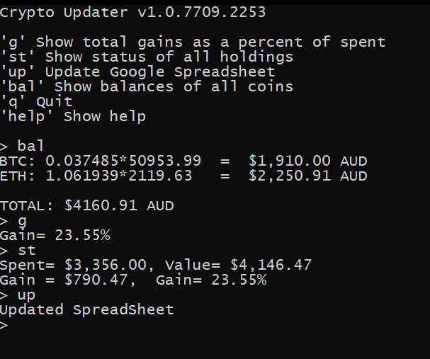

# CoinSpot/Google Sheets Updater

This simple console application reads values from your CoinSpot account, and writes the total values of your holdings to a GoogleSheet spread sheet.

Of course you will need to supply your own API keys and secrets for the APIs used.

It's faster to type 'g' or 'bal' into the console of this app, rather than opening a new tab, logging in, and checking things.

This app will also automatically update fields in a Google spreadsheet of yours, if you like that sort of  thing. This requires extra setup of course, but it's not hard.

Most people that invest in crypto-currencies have their own spreadsheets. This app will give you basic use cases, and also provide a basis for more elaborate automation if you wish.

## Example Screenshot

This is using an alt account setup, but shows the basics of what you can expect.

Note that when you use the 'up' command, if you have the Spreadsheet open in a browser window, it will instantly update as well.

You can use this framework to connect your inputs from CoinSpot to your outputs/analysis in Google Sheets.

An example session using an alt account of mine:

## Setup

Most configuration is stored in `App.config`.

You will need a *CoinSpot* account. The default is CoinSpot Australia.

You will also need a *Google* account and at least one *Google Sheet* if you wish to use the auto-update methods. You can use the app without this of course.

There's an example `App.config` file provided called `App.config.example`. You will need to edit this to add your personal keys and rename it to `App.config`.

## CoinSpot API

Login to CoinSpot and get an API key and secret. Add them to `App.config`.

## GoogleSheets API

Get your Google API credentials from [this page](https://developers.google.com/sheets/api/quickstart/dotnet). Put it in the folder along side the executable. Add your spreadsheet id to `App.config`.

## Usage
It's a simple console application, which starts by printing the help screen.

Follow the dots.

## Help

Raise an issue on *GitHub* if you have any questions or bug reports, or [email me](mailto:christian@schladetsch.com) directly. Happy to help set you up.

